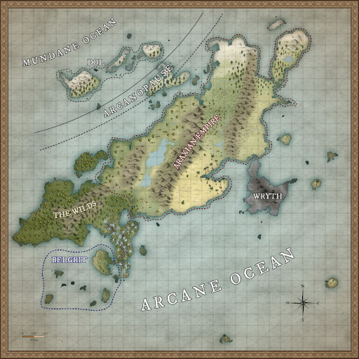

# Welcome to Delgar!

Delgar is a fantasy worldbuilding project I've been working on with some help from my brother and various friends for the past... many years.

It has played host to short stories, D&D campaigns, and more, and I'm making it available here for anyone who might find it interesting.

Bear in mind that this is mostly a personal project and this site is bound to be full of outdated and incorrect information, broken links, incoherent rambling, and all manner of nonsense. I cannot promise any of this will make sense or be fun or even possible to read.

Anyway, have at it!

## Articles

- [Calendar](./pages/calendar.md)
- [Languages](./pages/languages/index.md)
- [Geography](./pages/geography.md)
- [Timeline](./pages/timeline.md)
